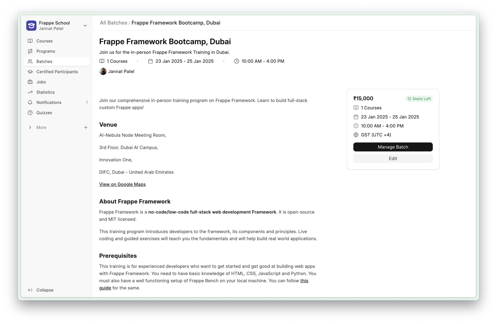
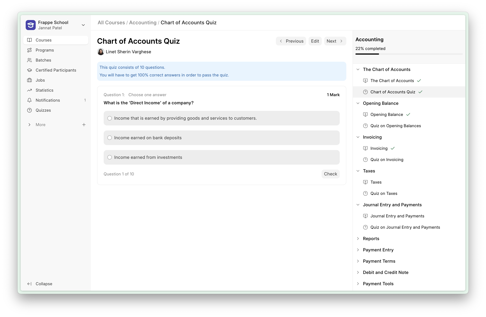
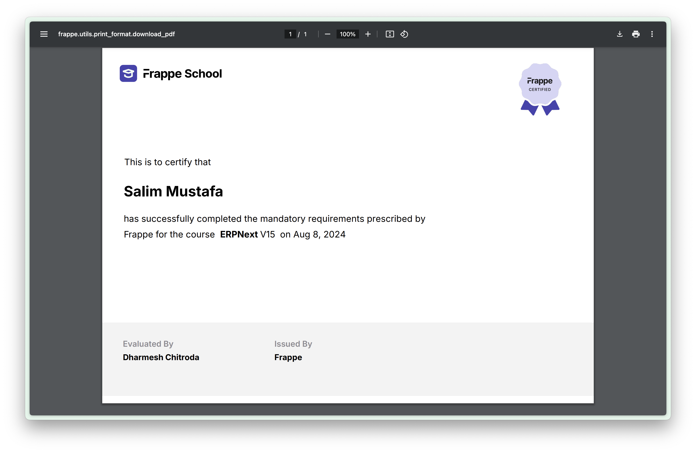

<<<<<<< HEAD
# LMS


## Getting started

To make it easy for you to get started with GitLab, here's a list of recommended next steps.

Already a pro? Just edit this README.md and make it your own. Want to make it easy? [Use the template at the bottom](#editing-this-readme)!

## Add your files

- [ ] [Create](https://docs.gitlab.com/ee/user/project/repository/web_editor.html#create-a-file) or [upload](https://docs.gitlab.com/ee/user/project/repository/web_editor.html#upload-a-file) files
- [ ] [Add files using the command line](https://docs.gitlab.com/topics/git/add_files/#add-files-to-a-git-repository) or push an existing Git repository with the following command:

```
cd existing_repo
git remote add origin https://gitlab.ctgroupvietnam.com/ctm/software/cterp/lms.git
git branch -M prod
git push -uf origin prod
```

## Integrate with your tools

- [ ] [Set up project integrations](https://gitlab.ctgroupvietnam.com/ctm/software/cterp/lms/-/settings/integrations)

## Collaborate with your team

- [ ] [Invite team members and collaborators](https://docs.gitlab.com/ee/user/project/members/)
- [ ] [Create a new merge request](https://docs.gitlab.com/ee/user/project/merge_requests/creating_merge_requests.html)
- [ ] [Automatically close issues from merge requests](https://docs.gitlab.com/ee/user/project/issues/managing_issues.html#closing-issues-automatically)
- [ ] [Enable merge request approvals](https://docs.gitlab.com/ee/user/project/merge_requests/approvals/)
- [ ] [Set auto-merge](https://docs.gitlab.com/user/project/merge_requests/auto_merge/)

## Test and Deploy

Use the built-in continuous integration in GitLab.

- [ ] [Get started with GitLab CI/CD](https://docs.gitlab.com/ee/ci/quick_start/)
- [ ] [Analyze your code for known vulnerabilities with Static Application Security Testing (SAST)](https://docs.gitlab.com/ee/user/application_security/sast/)
- [ ] [Deploy to Kubernetes, Amazon EC2, or Amazon ECS using Auto Deploy](https://docs.gitlab.com/ee/topics/autodevops/requirements.html)
- [ ] [Use pull-based deployments for improved Kubernetes management](https://docs.gitlab.com/ee/user/clusters/agent/)
- [ ] [Set up protected environments](https://docs.gitlab.com/ee/ci/environments/protected_environments.html)

***

# Editing this README

When you're ready to make this README your own, just edit this file and use the handy template below (or feel free to structure it however you want - this is just a starting point!). Thanks to [makeareadme.com](https://www.makeareadme.com/) for this template.

## Suggestions for a good README

Every project is different, so consider which of these sections apply to yours. The sections used in the template are suggestions for most open source projects. Also keep in mind that while a README can be too long and detailed, too long is better than too short. If you think your README is too long, consider utilizing another form of documentation rather than cutting out information.

## Name
Choose a self-explaining name for your project.

## Description
Let people know what your project can do specifically. Provide context and add a link to any reference visitors might be unfamiliar with. A list of Features or a Background subsection can also be added here. If there are alternatives to your project, this is a good place to list differentiating factors.

## Badges
On some READMEs, you may see small images that convey metadata, such as whether or not all the tests are passing for the project. You can use Shields to add some to your README. Many services also have instructions for adding a badge.

## Visuals
Depending on what you are making, it can be a good idea to include screenshots or even a video (you'll frequently see GIFs rather than actual videos). Tools like ttygif can help, but check out Asciinema for a more sophisticated method.

## Installation
Within a particular ecosystem, there may be a common way of installing things, such as using Yarn, NuGet, or Homebrew. However, consider the possibility that whoever is reading your README is a novice and would like more guidance. Listing specific steps helps remove ambiguity and gets people to using your project as quickly as possible. If it only runs in a specific context like a particular programming language version or operating system or has dependencies that have to be installed manually, also add a Requirements subsection.

## Usage
Use examples liberally, and show the expected output if you can. It's helpful to have inline the smallest example of usage that you can demonstrate, while providing links to more sophisticated examples if they are too long to reasonably include in the README.

## Support
Tell people where they can go to for help. It can be any combination of an issue tracker, a chat room, an email address, etc.

## Roadmap
If you have ideas for releases in the future, it is a good idea to list them in the README.

## Contributing
State if you are open to contributions and what your requirements are for accepting them.

For people who want to make changes to your project, it's helpful to have some documentation on how to get started. Perhaps there is a script that they should run or some environment variables that they need to set. Make these steps explicit. These instructions could also be useful to your future self.

You can also document commands to lint the code or run tests. These steps help to ensure high code quality and reduce the likelihood that the changes inadvertently break something. Having instructions for running tests is especially helpful if it requires external setup, such as starting a Selenium server for testing in a browser.

## Authors and acknowledgment
Show your appreciation to those who have contributed to the project.

## License
For open source projects, say how it is licensed.

## Project status
If you have run out of energy or time for your project, put a note at the top of the README saying that development has slowed down or stopped completely. Someone may choose to fork your project or volunteer to step in as a maintainer or owner, allowing your project to keep going. You can also make an explicit request for maintainers.
=======
<div align="center" markdown="1">


<h1>Frappe Learning</h1>

**Easy to use, open source, Learning Management System**


</div>


<div align="center">
	
</div>
<br />
<div align="center">
	<a href="https://frappe.io/learning">Website</a>
	-
	<a href="https://docs.frappe.io/learning">Documentation</a>
</div>

## Frappe Learning
Frappe Learning is an easy-to-use learning system that helps you bring structure to your content.

### Motivation
In 2021, we were looking for a Learning Management System to launch [Mon.School](https://mon.school) for FOSS United. We checked out Moodle, but it didn’t feel right. The forms were unnecessarily lengthy and the UI was confusing. It shouldn't be this hard to create a course right? So I started making a learning system for Mon.School which soon became a product in itself. The aim is to have a simple platform that anyone can use to launch a course of their own and make knowledge sharing easier.

### Key Features

- **Structured Learning**: Design a course with a 3-level hierarchy, where your courses have chapters and you can group your lessons within these chapters. This ensures that the context of the lesson is set by the chapter.

- **Live Classes**: Group learners into batches based on courses and duration. You can then create Zoom live class for these batches right from the app. Learners get to see the list of live classes they have to take as a part of this batch.

- **Quizzes and Assignments**: Create quizzes where questions can have single-choice, multiple-choice options, or can be open ended. Instructors can also add assignments which learners can submit as PDF's or Documents.

- **Getting Certified**: Once a learner has completed the course or batch, you can grant them a certificate. The app provides an inbuilt certificate template. You can use this or else create a template of your own and use that instead.

<details>
<summary>View Screenshots</summary>



<div align="center">
	<sub>
		Create batches to group your learners
	</sub>
</div>
<br>



<div align="center">
	<sub>
		Evaluate their knowledge by quizzes
	</sub>
</div>
<br>



<div align="center">
	<sub>
		Autenticate their work with certification
	</sub>
</div>
</details>


### Under the Hood

- [**Frappe Framework**](https://github.com/frappe/frappe): A full-stack web application framework.

- [**Frappe UI**](https://github.com/frappe/frappe-ui): A Vue-based UI library, to provide a modern user interface.

## Production Setup

### Managed Hosting

You can try [Frappe Cloud](https://frappecloud.com), a simple, user-friendly and sophisticated [open-source](https://github.com/frappe/press) platform to host Frappe applications with peace of mind.

It takes care of installation, setup, upgrades, monitoring, maintenance and support of your Frappe deployments. It is a fully featured developer platform with an ability to manage and control multiple Frappe deployments.

<div>
	<a href="https://frappecloud.com/lms/signup" target="_blank">
		<picture>
			<source media="(prefers-color-scheme: dark)" srcset="https://frappe.io/files/try-on-fc-white.png">
			
		</picture>
	</a>
</div>

### Self Hosting

Follow these steps to set up Frappe Learning in production:

**Step 1**: Download the easy install script

```bash
wget https://frappe.io/easy-install.py
```

**Step 2**: Run the deployment command

```bash
python3 ./easy-install.py deploy \
    --project=learning_prod_setup \
    --email=your_email.example.com \
    --image=ghcr.io/frappe/lms \
    --version=stable \
    --app=lms \
    --sitename subdomain.domain.tld
```

Replace the following parameters with your values:
- `your_email.example.com`: Your email address
- `subdomain.domain.tld`: Your domain name where Learning will be hosted

The script will set up a production-ready instance of Frappe Learning with all the necessary configurations in about 5 minutes.

**Note:** To avoid a `404 Page Not Found` error:
- If hosting on a **public server**, make sure your DNS **A record** points to your server's IP.
- If hosting **locally**, map your domain to `127.0.0.1` in your `/etc/hosts` file:

## Development Setup

### Docker

You need Docker, docker-compose and git setup on your machine. Refer [Docker documentation](https://docs.docker.com/). After that, follow below steps:

**Step 1**: Setup folder and download the required files

    mkdir frappe-learning
    cd frappe-learning

    # Download the docker-compose file
    wget -O docker-compose.yml https://raw.githubusercontent.com/frappe/lms/develop/docker/docker-compose.yml

    # Download the setup script
    wget -O init.sh https://raw.githubusercontent.com/frappe/lms/develop/docker/init.sh

**Step 2**: Run the container and daemonize it

    docker compose up -d

**Step 3**: The site [http://lms.localhost:8000/lms](http://lms.localhost:8000/lms) should now be available. The default credentials are:
- Username: Administrator
- Password: admin

### Local

To setup the repository locally follow the steps mentioned below:

1. Install bench and setup a `frappe-bench` directory by following the [Installation Steps](https://frappeframework.com/docs/user/en/installation)
1. Start the server by running `bench start`
1. In a separate terminal window, create a new site by running `bench new-site learning.test`
1. Map your site to localhost with the command `bench --site learning.test add-to-hosts`
1. Get the Learning app. Run `bench get-app https://github.com/frappe/lms`
1. Run `bench --site learning.test install-app lms`.
1. Now open the URL `http://learning.test:8000/lms` in your browser, you should see the app running

## Learn and connect

- [Telegram Public Group](https://t.me/frappelms)
- [Discuss Forum](https://discuss.frappe.io/c/lms/70)
- [Documentation](https://docs.frappe.io/learning)
- [YouTube](https://www.youtube.com/channel/UCn3bV5kx77HsVwtnlCeEi_A)

<br>
<br>
<div align="center" style="padding-top: 0.75rem;">
	<a href="https://frappe.io" target="_blank">
		<picture>
			<source media="(prefers-color-scheme: dark)" srcset="https://frappe.io/files/Frappe-white.png">
			
		</picture>
	</a>
</div>
>>>>>>> 41293130 (Merge pull request #1803 from rehanrehman389/brand-setting)
